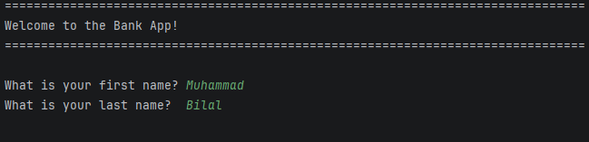

# 💳 Java OOP Banking Application

A console-based banking application built in Java that simulates basic account management operations including account creation, deposits, withdrawals, and input validation.

---

## 📌 Overview

This application demonstrates Object-Oriented Programming (OOP) principles in Java by implementing a simple banking system.

When the program runs:

1. The user is greeted with a formatted application header
2. The user enters their first and last name
3. An account is created with:
    - A unique auto-incremented ID
    - A starting balance of 0.00
4. The user can repeatedly choose to:
    - Deposit money
    - Withdraw money
    - Quit the application
5. The program continues running until the user chooses to quit

All user input is validated to ensure correct formatting and logical consistency.

---

## ⚙️ Program Features

- Automatic account ID generation
- Name validation (no empty names allowed)
- Currency validation (up to 2 decimal places only)
- Prevents zero or negative deposits
- Prevents overdraft withdrawals
- Prevents zero or negative withdrawals
- Case-insensitive menu options
- Clean console formatting with separator lines
- Custom exception messages for invalid operations

---

## 🖥 Example Program Output

### 🔹 Application Startup

### 🔹 Successful Deposit

 

### 🔹 Withdrawal Validation Error

### 🔹 Successful Withdrawal

---

## 🧠 Concepts Demonstrated

- Object-Oriented Programming (OOP)
- Classes and Objects
- Constructor Overloading
- Encapsulation (private fields with controlled setters)
- Static Class Variables (auto-incrementing account ID)
- Method Overriding (`toString`)
- Exception Handling (`try/catch`)
- Custom `IllegalArgumentException`
- Input Validation using Regular Expressions
- Pattern Matching (`java.util.regex.Pattern`)
- Loop Control with labeled `while` loop
- Switch Statements
- Case-insensitive string handling
- Formatted Output (`System.out.printf`)
- Scanner for user input

---

## 🔍 Technical Highlights

### Account Class
- Maintains a static `lastId` variable for unique account generation
- Validates first and last name inputs
- Enforces business rules for deposits and withdrawals
- Overrides `toString()` to provide formatted account information

### BankApp Class
- Handles all user interaction
- Validates currency input using regex:
  ^\d+(\.\d{1,2})?$
- Prevents application crash through exception handling

---

## 👤 Author

**Muhammad Bilal**

GitHub: https://github.com/mbilalcyber/Banking-App.git 

